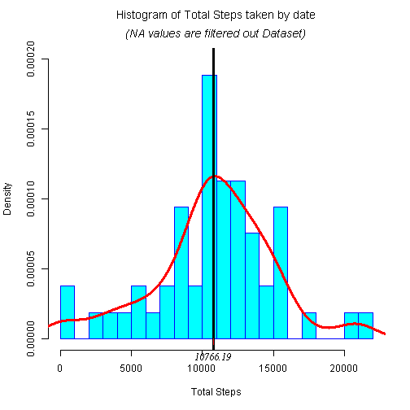
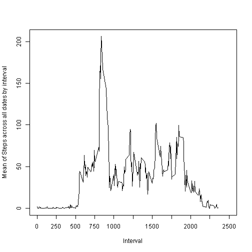
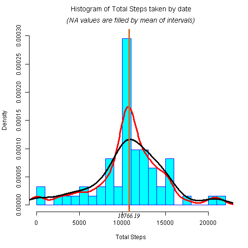
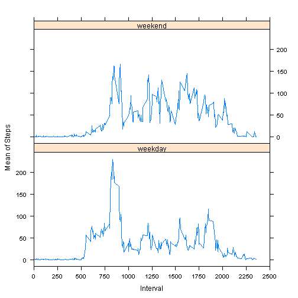

Reproducible Research: Peer Assessment 1
==========================================


## Set code visible to public


```r
# Always make code visible

echo = TRUE  
```


## Loading and preprocessing the data

* Loading data and store in dataset **data**


```r
data<-read.csv("activity.csv",stringsAsFactors=FALSE)
```

* Convert variable date to format **Date**


```r
data$date<-as.Date(data$date)
```

* Ignore missing values and store in dataset **dat**


```r
dat<-na.omit(data) 
```

## What is mean total number of steps taken per day?

* Calculate total steps taken by date

- Calculate **total steps** taken by date and store in variable **steps_date**


```r
steps_date<-aggregate(dat$steps, by=list(date=dat$date), FUN=sum)
```

- Calculate **Mean, Median** and **Standard Deviation** of total steps taken by date  and store in variables **mean_steps_date**, **median_steps_date** and **sd_steps_date**


```r
mean_steps_date<-mean(steps_date$x)
median_steps_date<-median(steps_date$x)
sd_steps_date<-sqrt(median_steps_date)

head(steps_date)
```

```
##         date     x
## 1 2012-10-02   126
## 2 2012-10-03 11352
## 3 2012-10-04 12116
## 4 2012-10-05 13294
## 5 2012-10-06 15420
## 6 2012-10-07 11015
```

```r
mean_steps_date
```

```
## [1] 10766.19
```

```r
median_steps_date
```

```
## [1] 10765
```

* In order to see clearer the distribution of data, I plotted the Histogram and Density line of the total number of steps taken each day on the same plot. I also put in this plot Mean and Median lines in purple and black colors respectively
  
* We can see the median and mean values are very close, it shows on the plot that 02 mean and median lines are overlapped


```r
dens<-density(steps_date$x)

hist(steps_date$x,probability=TRUE,col="cyan",border="blue", breaks = 20,ylim=range(0,0.00020),
     main = expression(atop("Histogram of Total Steps taken by date",italic("(NA values are filtered out Dataset)"))), xlab = "Total Steps")

lines(dens,lwd=3,col="red")
abline(v = mean_steps_date, col = "purple",lwd=3)
abline(v = median_steps_date, col = "black",lwd=3)
axis(1,mean_steps_date,labels=TRUE,font=8,col.ticks="red",line=-1)
```

 

## What is the average daily activity pattern?

* Calculate mean of number of steps taken across days by interval

- Calculate mean of number of steps taken across days by interval and store in variable **intervals**


```r
intervals<-aggregate(dat$steps, by=list(interval=dat$interval), FUN=mean)
head(intervals)
```

```
##   interval         x
## 1        0 1.7169811
## 2        5 0.3396226
## 3       10 0.1320755
## 4       15 0.1509434
## 5       20 0.0754717
## 6       25 2.0943396
```

* Plot Time Series of the 5-minute interval (x-axis) and the average number of steps taken, averaged across all days (y-axis).


```r
plot(intervals$interval,intervals$x,type="l",xlim=range(0:2500),
     xlab="Interval",ylab="Mean of Steps across all dates by interval")

xlabel <- seq(0, 2500, by = 250)
axis(1, at = xlabel)
```

 

- Calculate total steps taken by interval store in variables **interval_sum**


```r
interval_sum<-aggregate(dat$steps, by=list(interval=dat$interval), FUN=sum)
head(interval_sum)
```

```
##   interval   x
## 1        0  91
## 2        5  18
## 3       10   7
## 4       15   8
## 5       20   4
## 6       25 111
```

- Calculate Max value of total steps taken by interval and store in variables **max_interval**


```r
max_interval<-interval_sum[interval_sum$x == max(interval_sum$x),]
max_interval
```

```
##     interval     x
## 104      835 10927
```

* Plot Time Series of the 5-minute interval (x-axis) and the toatl number of steps taken across all days (y-axis)


```r
plot(interval_sum$interval,interval_sum$x,type="l",xlim=range(0:2500),
     xlab="Interval",ylab="Sum of Steps across all dates")

xlabel <- seq(0, 2500, by = 250)
axis(1, at = xlabel)
```

 

## Imputing missing values

- Calculate number rows with NAs


```r
rows<-nrow(data)
rows_omit_na<-nrow(dat)
rows-rows_omit_na 
```

```
## [1] 2304
```

- Fill NAs of original dataset data by mean of intervals which is stored in variable **interval_mean**


```r
interval_mean<-aggregate(dat$steps, by=list(interval=dat$interval), FUN=mean)

for(i in 1:nrow(data))
{
  if(is.na(data[i,1]))
  {
    match_index<-match(data[i,3],interval_mean$interval)
    data[i,1] = interval_mean[match_index,2]
  }
}

head(data)
```

```
##       steps       date interval
## 1 1.7169811 2012-10-01        0
## 2 0.3396226 2012-10-01        5
## 3 0.1320755 2012-10-01       10
## 4 0.1509434 2012-10-01       15
## 5 0.0754717 2012-10-01       20
## 6 2.0943396 2012-10-01       25
```

- Calculate total steps taken by date of **filled dataset** and store in variable **steps_date_full**


```r
steps_date_full<-aggregate(data$steps, by=list(date=data$date), FUN=sum)
head(steps_date_full)
```

```
##         date        x
## 1 2012-10-01 10766.19
## 2 2012-10-02   126.00
## 3 2012-10-03 11352.00
## 4 2012-10-04 12116.00
## 5 2012-10-05 13294.00
## 6 2012-10-06 15420.00
```

- Calculate Mean and Median of total steps taken by date of **filled dataset** and store in variables **mean_steps_date_full** and **median_steps_date_full**


```r
mean_steps_date_full<-mean(steps_date_full$x)
median_steps_date_full<-median(steps_date_full$x)
sd_steps_date_full<-sqrt(median_steps_date_full)

mean_steps_date_full
```

```
## [1] 10766.19
```

```r
median_steps_date_full
```

```
## [1] 10766.19
```

- Plot Histogram included Density line of the total number of steps taken each day of **filled dataset**

### Impact of imputing missing data

 In order to be easier to see the impact of imputing missing data on the estimates of the total daily number of steps, I also draw Density line of igonred-NAs dataset in black

1- We can see the mean values of 02 dataset nearly the same, both are 10766.19

2- However, the median changed a little bit, 10755 and 10766.19, respectively

3- Imputing missing values made datas distributed closer to mean value, median equals mean. The distribution line is narrower and closer to Normal Distribution


```r
dens_full<-density(steps_date_full$x)
hist(steps_date_full$x,probability=TRUE,col="cyan",border="blue",breaks = 20, ylim=range(0,0.00030),
     main = expression(atop("Histogram of Total Steps taken by date",italic("(NA values are filled by mean of intervals)"))), xlab = "Total Steps")
lines(dens_full,lwd=3,col="red")
lines(dens,lwd=3,col="black")
abline(v = mean_steps_date_full, col = "purple",lwd=3)
abline(v = median_steps_date_full, col = "chocolate",lwd=3)
axis(1,round(mean_steps_date_full,digit=2),labels=TRUE,font=8,col.ticks="red",line=-1)
```

 

## Are there differences in activity patterns between weekdays and weekends?

- Add variable weekday to dataset


```r
data$weekday<-weekdays(data$date)
```

- Store weekdays and weekend in variables **weekdays** and **weekend**


```r
weekdays<-c("Monday", "Tuesday", "Wednesday", "Thursday", "Friday")
weekend<-c("Saturday", "Sunday")
```

- Store index of elements of dataset  which are in weekdays and weekend


```r
weekday_index<-which(data$weekday %in% weekdays)
weekend_index<-which(data$weekday %in% weekend)
```

- Subset data weekdays and weekend separated


```r
data_weekdays<-data[weekday_index,]
data_weekend<-data[weekend_index,]
```

- Calculate mean of number of steps taken across days by interval and store in variables **weekday_intervals** and **weekend_intervals**


```r
weekday_intervals<-aggregate(data_weekdays$steps, by=list(interval=data_weekdays$interval), FUN=mean)
weekend_intervals<-aggregate(data_weekend$steps, by=list(interval=data_weekend$interval), FUN=mean)
```

- Add variable **weekday** to these datasets


```r
weekday_intervals$weekday<-c(rep("weekday",nrow(weekday_intervals)))
weekend_intervals$weekday<-c(rep("weekend",nrow(weekend_intervals)))
```

- Join 02 datasets for ploting


```r
data_plot<-rbind(weekday_intervals,weekend_intervals)
```

- Load library **lattice**


```r
library(lattice)
```

- Plot Time Series of the 5-minute interval (x-axis) and the average number of steps taken, averaged across all Weekdays and Weekend Days (y -axis) 


```r
plot<-xyplot(x~interval|weekday,data = data_plot, type = "l", layout = c(1,2), 
       scales = list(x = list(at = seq(0, 2500, 250), limits = c(0, 2500))),
       xlab="Interval",ylab="Mean of Steps")

print(plot)
```

 
